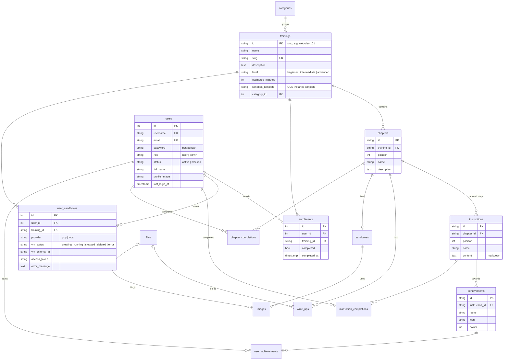

# Database

Velox Academy stores its data in PostgreSQL. The schema is managed with
[Knex](https://knexjs.org/) migrations (`backend/app/migrations`) and accessed
through [Objection.js](https://vincit.github.io/objection.js/) models
(`backend/app/models`).

## Entity relationship diagram

`enrollments`, `user_sandboxes`, `instruction_completions`,
`chapter_completions` and `user_achievements` are unique per user and
training/instruction/chapter/achievement.

### Deletion rules

| When you delete… | …this happens |
| --- | --- |
| a user | their enrollments, sandboxes, progress and achievements are deleted |
| a training | its chapters (and their instructions, write-ups, sandboxes), enrollments and user sandboxes are deleted |
| a chapter | its instructions, write-ups, sandbox and completions are deleted |
| an instruction | its completions are deleted; achievements stay (instruction is set to `NULL`) |
| a category | its trainings stay uncategorised (`category_id` is set to `NULL`) |

Deleting a training or a user removes the `user_sandboxes` rows; the API
deletes the cloud VMs behind them first.

## Migrations

Migrations run automatically when the API starts. The API first waits for
PostgreSQL to accept connections (`DB_CONNECT_RETRIES`, default 10 attempts)
and exits if the database never becomes available, so the container is
restarted instead of serving requests without a schema.

From `backend/app` you can also run them by hand:

| Command | What it does |
| --- | --- |
| `npm run db:migrate` | Apply pending migrations |
| `npm run db:status` | List applied and pending migrations |
| `npm run db:rollback` | Undo the last batch |
| `npm run db:rollback:all` | Undo every migration |
| `npm run db:seed` | Insert the demo catalog and the admin user |
| `npm run db:reset` | Roll back everything, migrate and seed |
| `npm run db:make-admin -- <email>` | Give an existing account the admin role |

Use these scripts rather than the raw `knex` CLI: they also rename
`add_user_sandboxes.js` to `02_add_user_sandboxes.js` in the `knex_migrations`
table of databases created before that file was renamed.

New migrations are numbered (`08_…`, `09_…`) so that they always sort after the
existing ones.

## Seeds

Seeds only insert rows that do not exist yet (`ON CONFLICT DO NOTHING`), so
running them repeatedly never overwrites content edited by an admin. They only
fill values that are missing, e.g. lesson content after a migration was rolled
back and re-applied. Because missing rows are recreated, a demo training that
an admin deletes comes back on the next start in development; set
`SEED_ON_START=false` to keep such deletions.

- `seeds/01_admin_user.js` creates the admin account if no account with that
  username or e-mail exists. It never changes existing accounts (promoting an
  account by name would let anyone who registers that username become admin);
  use `npm run db:make-admin -- <email>` instead.
- `seeds/02_catalog.js` creates the demo catalog: 4 categories, 4 trainings,
  9 chapters, 30 instructions and 9 achievements. The structure lives in
  `seeds/data/catalog.js` and every instruction's markdown body in
  `seeds/content/<instruction id>.md`.

Seeds run on startup unless `NODE_ENV=production`; set `SEED_ON_START=true` or
`false` to override.

## Configuration

| Variable | Default | Description |
| --- | --- | --- |
| `DATABASE_URL` | – | Full connection string; overrides the `DB_*` variables |
| `DB_HOST` | `db` | PostgreSQL host (the docker-compose service name) |
| `DB_PORT` | `5432` | PostgreSQL port |
| `DB_NAME` | `velox` (`velox_test` when `NODE_ENV=test`) | Database name |
| `DB_USER` / `DB_PASSWORD` | `postgres` / `postgres` | Credentials |
| `DB_POOL_MAX` | `10` | Maximum pool size |
| `DB_CONNECT_RETRIES` | `10` | Connection attempts on startup (2 s apart) |
| `SEED_ON_START` | `true` outside production | Run seeds on startup |
| `ADMIN_USERNAME` / `ADMIN_EMAIL` / `ADMIN_PASSWORD` | `admin` / `contact.ilhanozkan@gmail.com` / `1234` | Admin account created on a database without one. In production the admin is only created when `ADMIN_PASSWORD` is set. |

> **Existing installations** keep the admin account the original schema
> created (`admin` / `1234`); the upgrade gives it the `admin` role. Change its
> password after upgrading — the variables above do not modify existing
> accounts.